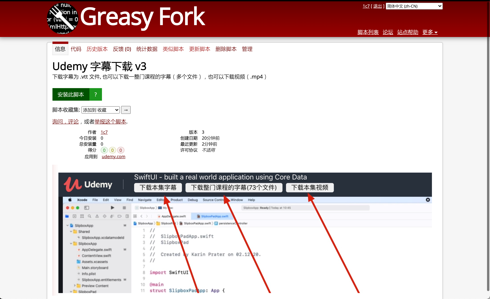
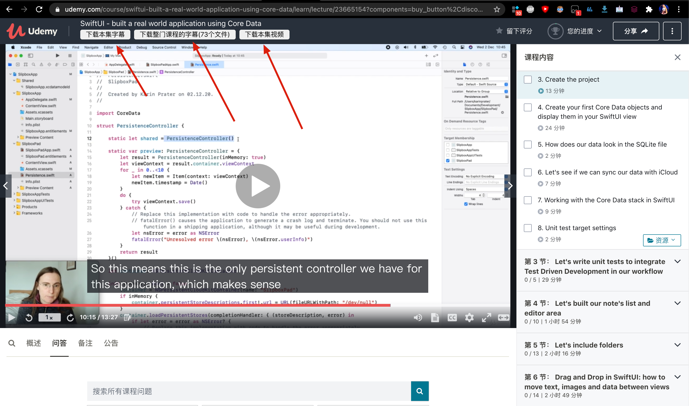

# Udemy Subtitle Downloader
下载 Udemy 字幕。写于2021-3-3。 

## 用途
1. 下载字幕为 .vtt 文件
2. 下载视频 (.mp4)

## 安装地址
https://greasyfork.org/zh-CN/scripts/422576-udemy-subtitle-downloader-v3
  

## 安装后
页面上多了3个按钮
  

全景图
  

## 问题：udemy-dl 下载不了字幕吗？
https://github.com/r0oth3x49/udemy-dl
可以下 .srt 字幕，完全没问题。

## 问题：udemy-dl 不好用？
也不是，使用很简单。

## 问题：udemy-dl 已经能下载视频和字幕了，写这个干嘛？
方便一些，不用命令行。
页面上有按钮，点击就能下载。
